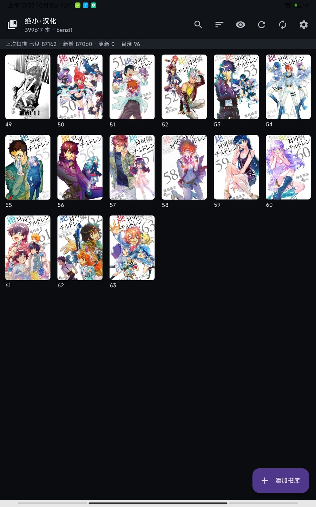
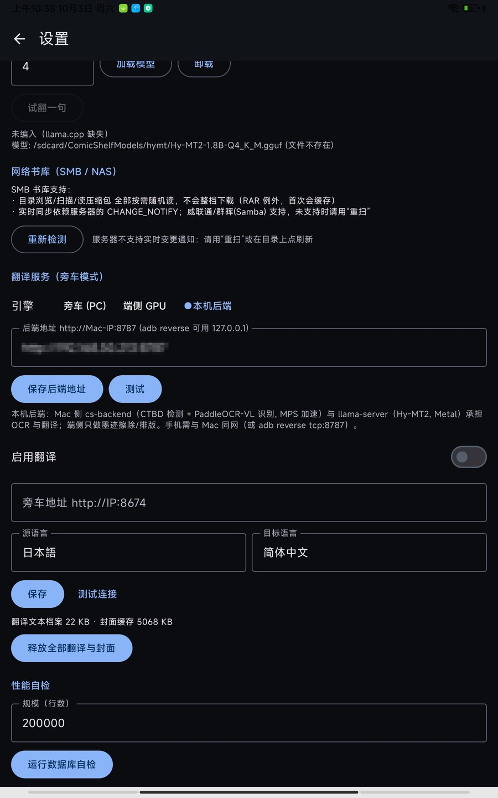
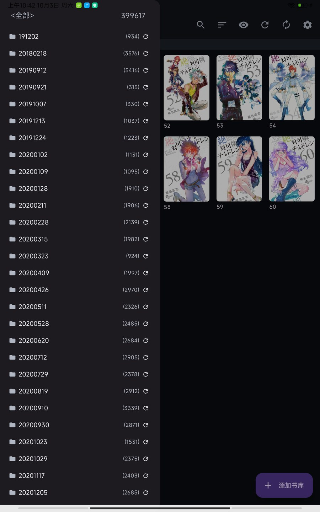
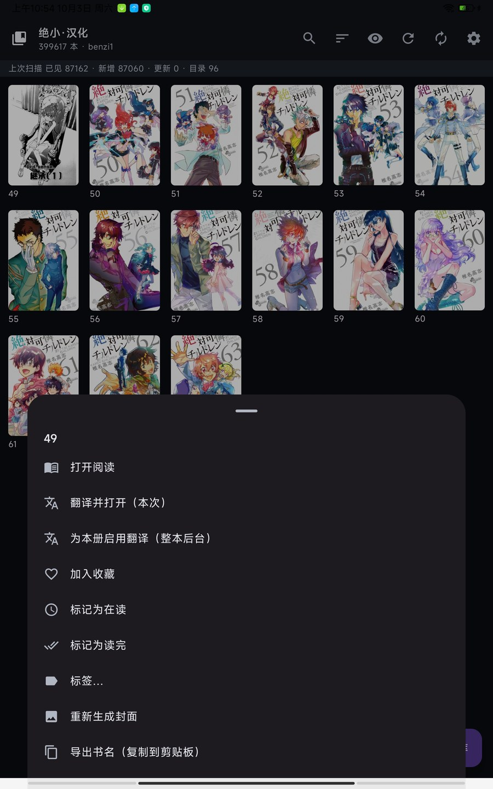

# ComicShelf for Android

**NAS 直连的大书库漫画阅读器 + 局域网 OCR/翻译后端。**
为日漫阅读优化：SMB 直连书库、十万级书目虚拟化滚动、RTL/双页/缩放。
再配上**整本书后台机翻**——书库页一键启动，翻译在局域网内的电脑上跑
（检测 → OCR → LLM），手机只需上传整页并排版，边读边出、随时停续。

- 📚 **大书库**：SQLite 索引 + 虚拟化分页（十万级书目流畅滚动）、增量扫描、多书库、目录树、搜索、收藏/阅读状态/标签/书签
- 📖 **阅读器**：翻页（左右分区点击）、双页对开、RTL（日漫）、捏合缩放+双击、旋转、进度记忆、三级封面缓存
- 🗂 **格式**：zip/cbz、rar/cbr、目录型；stb / WebP / AVIF 解码链
- 🌐 **网络**：SMB2/SMB3 直连 NAS（多共享、多凭据）
- 🈶 **翻译**（核心差异点）：
  - **局域网后端**（推荐）：后端跑 CTBD 检测 + PaddleOCR-VL 识别 + Hy-MT2(llama.cpp) 翻译，手机端零算力负担
  - **端侧 GGUF**（可选）：需自备 llama.cpp 源码，纯离线
  - BT Sakura 机制完整移植：官方 system prompt、**两级独立阶梯**（重复检测 + 行数对齐）、逐行兜底、永不空手返回
  - **整本书后台队列**：书架启动 → 可见页插队 → 暂停/继续/跨会话续传

## 截图

| 书库 / 书架（扫描统计、封面、阅读进度） | 翻译设置（局域网后端：地址 / 测试 / 缓存用量） |
|---|---|
|  |  |

| 目录树（多级目录 + 每目录书目数） | 书籍操作（长按：翻译 / 阅读 / 封面 / 标记 / 标签） |
|---|---|
|  |  |

## 架构

```
┌─ 手机 ComicShelf ────────────────────────────────────────────────┐
│ 书架/阅读器 (Kotlin + Compose)                                    │
│   │ ① 整页 PNG 上传              ② BT Sakura 阶梯（机制在 App 侧） │
│   │   POST /ocr_page             POST /chat {system,user,…}       │
│   ▼                                 ▼                            │
│ 设备档案（框+原文+译文 JSON）── 离线重渲染（墨迹擦除/排版，无网络） │
└───────────────┬───────────────────────────┬──────────────────────┘
                │ LAN (Wi-Fi 或 adb reverse) │
┌───────────────▼───────────────────────────▼──────────────────────┐
│ 任意电脑（Win/Linux/macOS）: backend/  (FastAPI)                  │
│   ① CTBD onnx 检测(CPU/CUDA) → 后处理链 → PaddleOCR-VL(CUDA/MPS)  │
│   ② /chat 原样转发 ──────────────┐                                │
│   sha1 整页缓存                   ▼                                │
│                     llama-server :8080 (llama.cpp, Metal/CUDA/CPU) │
│                     Hy-MT2-1.8B-Q4_K_M（OpenAI 兼容 /v1）          │
└───────────────────────────────────────────────────────────────────┘
```

后端可一键部署（`backend/deploy.py`，三平台同一入口、模型自动下载、LLM 三层降级），
App 端只认「后端地址」这一个配置项。详见 [backend/README.md](backend/README.md)。

## 目录结构

```
.
├── app/                      # 安卓应用（Kotlin + Compose + 原生 C++ 核心/JNI）
│   └── src/main/cpp/         #   core(数据库/扫描/vfs/压缩包/图像/翻译客户端) + JNI
├── backend/                  # 局域网 OCR/翻译后端（Python, 一键部署）
├── ehmeta-builder/           # E-Hentai 元数据桌面构建器（Mac/PC，Python 纯标准库）
├── build.gradle.kts / settings.gradle.kts
└── third_party/…             # 见 app/src/main/cpp/third_party（Vendored 依赖）
```

## 构建（App）

```bash
# 已知可用工具链组合（重要）：
#   Gradle 9.5.x + JDK 17~21 + AGP 8.13    ← Gradle 9.6+ 与 AGP 8.13 不兼容；JDK 26 的 jlink 会挂
export JAVA_HOME=/path/to/jdk-21
gradle :app:assembleDebug          # 或直接用 Android Studio 打开本目录
```

`local.properties` 需指向你的 Android SDK（`sdk.dir=…`，已被 .gitignore 忽略）。
首次构建会编译 vendored 的 C++ 第三方库（sqlite/ncnn/aom/libavif/webp/unrar/…），耗时数分钟。

### 可选依赖（缺失会自动裁剪，不影响"局域网后端翻译"主线）

| 组件 | 位置 | 缺失时 |
|---|---|---|
| libsmb2 头/运行库（NAS 支持） | `app/src/main/cpp/third_party/libsmb2` + `jniLibs/…/libsmb2.so` | 仓库已自带 |
| 端侧 NPU OCR（高通 QNN SDK，**专有不可再分发**） | `app/src/main/cpp/ocr/qnn_inc/`（自备） | 该路径裁剪；后端模式不受影响 |
| 端侧离线翻译（llama.cpp，MIT） | `<repo 上级>/deps/llama.cpp` 或 `-DCS_LLAMA_SRC=` | 该路径裁剪；后端模式不受影响 |

## 后端

见 [backend/README.md](backend/README.md)：拷贝目录 → `python deploy.py`（自动建 venv、按平台装依赖、
从 HuggingFace 下载三个模型（含国内镜像自动探测）、启动服务）。

**Windows（NVIDIA）一键部署**：见 [backend/cs-deploy/](backend/cs-deploy/)——双击 `deploy.bat`，
七阶段全自动（Python / 依赖 / llama.cpp 二进制 / 模型 / 启动健康检查，全程幂等可断点续跑），
真机实测约 40 分钟全自动；坑位、根因与运维手册见
[WINDOWS_DEPLOY_RECORD.md](backend/cs-deploy/WINDOWS_DEPLOY_RECORD.md)。

> **分发形态（重要）**：部署脚本的"从零自动下载仓库"兜底要求上游仓库可公开访问；
> 当前以**源码随包**形式分发——把 `comicshelf-android\` 整个文件夹与 `cs-deploy\`
> 放在同一目录（或其父目录）一起拷贝即可。脚本的同目录/父目录扫描原生支持该形态，
> 无需任何改动。

## 元数据构建器（桌面，可选）

见 [ehmeta-builder/README.md](ehmeta-builder/README.md)：在 Mac/PC 上构建 **E-Hentai 元数据数据库**
（产出 `ehmeta.db.zip`，供 App 设置页导入）。手动运行、自动从公开来源取数、支持填代理端口
（如 Clash 混合端口 `http://127.0.0.1:7897`）；纯 Python 标准库实现，含 CLI 与图形界面。
与 App 共用同一套经对账验证的构建管线（计数/键索引与发布包**逐字节一致**）。

## 许可与致谢

- 本项目以 **GPL-3.0** 发布（见 [LICENSE](LICENSE)）。原因：翻译机制（Sakura 模板、两级阶梯、
  重复检测、引号处理）移植自 BalloonTranslator（GPL-3.0，上游仓库现已不可公开访问；
  本项目基于其 0.9 版源码移植），检测后处理链亦以其为对照；衍生作品需保持同一许可。
- 第三方组件与其许可（ncnn / aom / libavif / libwebp / sqlite / stb / miniz / unrar / libsmb2 /
  llama.cpp / onnxruntime / AndroidX 等）见 [NOTICE](NOTICE)。
- 模型权重（CTBD、PaddleOCR-VL-For-Manga、Hy-MT2）**不在本仓库内**，由 `backend/fetch_models.py`
  从 HuggingFace 下载；使用请遵循各模型卡声明的许可。

## 免责声明

本项目是阅读器与翻译辅助工具：不提供、不附带、不托管任何漫画内容；
请遵守当地法律法规与内容版权，仅将翻译功能用于个人学习与研究。
